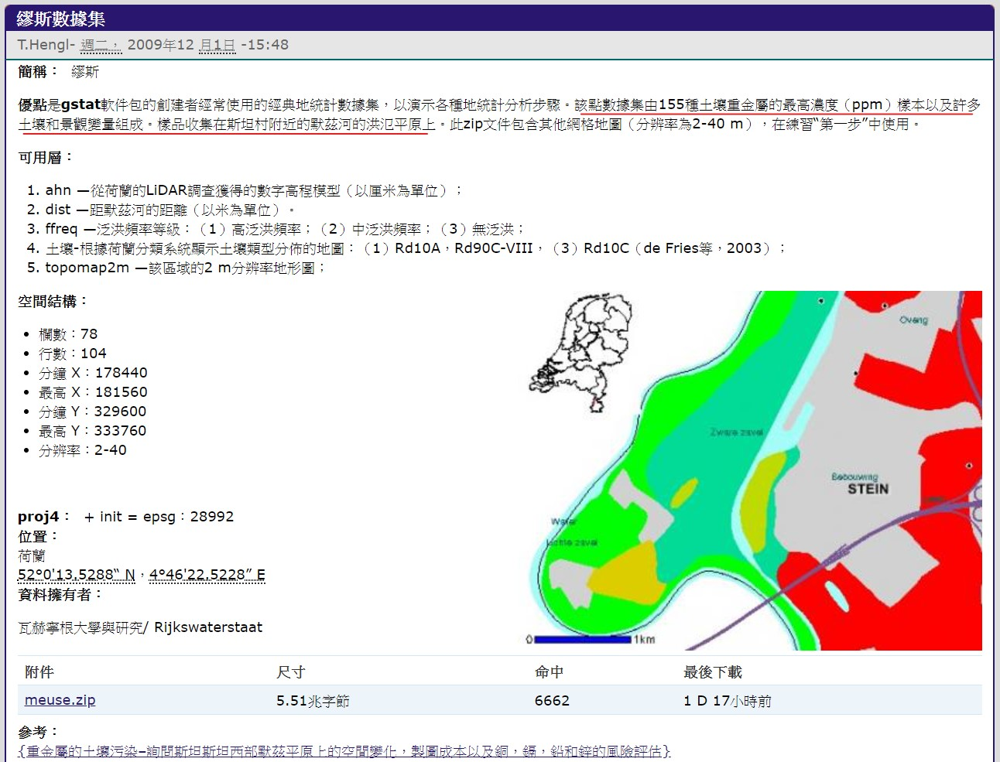

```{r setup, include=FALSE}
rm(list = ls()); invisible(gc())
library(knitr)
library(dplyr)
library(data.table)

library(sp)
library(gstat)
library(dplyr) # for "glimpse"
library(ggplot2)
library(scales) # for "comma"
opts_chunk$set(echo = TRUE)
```

# File Target

學習 reference/ 的  
"RPubs - An Introduction to Kriging in R"

--

# Introduction

When I first started working with spatial data in R, 
it took me a while before I could get used to it. 
當我第一次開始在R中使用空間數據時，花了我一段時間才習慣。

There were several obstacles, not the least of which being just to find 
which tutorials in which sequence would best help me grasp the larger picture of SP* classes. 
這裡有很多障礙，其中最重要的就是僅僅找到順序最合適的教程，
以幫助我更好地理解SP *類的概況。

My own personal difficulties aside, I eventually acclimated myself to them, 
and joined the r-sig-geo group to follow up with any developments pertinent to my work.  
除了我自己的個人困難之外，我最終使自己適應了這些困難，
並加入了r-sig-geo小組以跟進與我的工作有關的任何進展。

--

So, partly as a means of contributing to documentation 
that would help my own code be more readily understood by others, 
因此，一方面作為一種有助於文檔的方式，
可以幫助他人更輕鬆地理解我自己的代碼，

and partly due to finding that professionals on the r-sig-geo group 
were encountering some similar questions I had when I first started, 
I thought I would present an overview of 
some of the functionality available for working with spatial data in R.
另一方面，由於發現r-sig-geo小組的專業人員遇到了我剛開始時遇到的一些類似問題， 我以為我會概述一些可用於處理R中空間數據的功能。

--

This document, though, is intended to be an introduction to working with kriging in R. 
但是，本文檔旨在作為在R中使用kriging法的簡介。

A familiarity with kriging is already assumed; 
there are already more comprehensive resources available for anyone interested, whether broad overviews or more mathematical expositions with all the gory matrix algebra details. 
已經假定您熟悉克里金法;
對於任何感興趣的人，已經有更全面的資源可用，
無論是廣義概述還是帶有所有gory矩陣代數細節的數學說明。 

In particular, Allison Lassiter’s blog was a helpful resource when I was just getting started.
特別是，當我剛入門時，Allison Lassiter的博客是一個有用的資源。

---

# Packages Used

In working with spatial data the sp library is essential, 
and what many other packages build off of.   
在處理空間數據時，sp庫以及其他許多軟件包都可以構建而成。

More specifically,  the `spatial` classes (e.g., SpatialPoints, SpatialPointsDataFrame, etc) 
are defined in the `sp` package, 
while spatio-temporal classes are defined in the `spacetime` package.  
更具體地說，在`sp`包中定義了空間類（例如SpatialPoints，SpatialPointsDataFrame等），
而在`spacetime`包中定義了時空類。

For working with spatial (and spatio-temporal) data, we use the `gstat` package, 
which includes functionality for kriging, among other many things.
為了處理空間(和時空)數據，我們使用`gstat`軟件包，其中包括kriging功能以及其他許多功能。

```{r eval = F}
library(sp)
library(gstat)
```

---

# Dataset

The data we are using is the meuse dataset, which comes with the sp package.  
我們使用的數據是sp軟件包隨附的meuse數據集。

關於該數據集的介紹，請看 [Meuse data set | A Practical Guide to Geostatistical Mapping](http://spatial-analyst.net/book/meusegrids)。  



```{r eval = F}
# packages for manipulation & visualization
suppressPackageStartupMessages({
  library(dplyr) # for "glimpse"
  library(ggplot2)
  library(scales) # for "comma"
  library(magrittr)
})
```

```{r}
data(meuse)
glimpse(meuse) #功能和 meuse %>% str 相同。
```

--

The meuse dataset contains concentration(濃度) measurements for a number of chemical elements 
taken from the Meuse river in the Netherlands. 
More information can be found by checking the help page via ?meuse.  
meuse dataset 包含從荷蘭默茲河採集的多種化學元素的濃度測量值。
通過?meuse查看幫助頁面可以找到更多信息。

Of particular interest is that each value/measurement is associated with geographic coordinates, namely the x- and y- columns.  
特別令人感興趣的是，每個值/度量都與地理坐標(即x列和y列)相關聯。

A priori, given just the dataframe and no additional information, 
it might not be clear that those two columns indicate locations (I, at least, had never heard of RDH coordinates before).  
先驗地，僅給出數據框而沒有其他信息，
可能不清楚這兩列是否指示位置(至少，我以前從未聽說過RDH坐標)。 

And that’s what the motivation for SPDF’s was: to provide a structure 
which allows for coordinates to clearly be associated with corresponding data points.  
這就是SPDF的動機：提供一種結構，允許將坐標清楚地與相應的數據點相關聯。

For example, we can visually inspect how zinc(鋅) varies over the domain of interest 
where we map concentration to point size:  
例如，我們可以目視檢查鋅在感興趣區域中的變化，在該區域中我們將濃度映射到點大小：

```{r}
meuse %>% as.data.frame %>% 
  ggplot(aes(x, y)) + geom_point(aes(size=zinc), color="blue", alpha=3/4) + 
  ggtitle("Zinc Concentration (ppm)") + coord_equal() + theme_bw()
```

Clearly, the representativeness of the points sampled is still wanting, 
so ideally we would be able to estimate the zinc concentrations at other locations for which we don’t have measurements.  
That’s where kriging comes in.

顯然，仍需要採樣點的代表性，
因此，理想情況下，我們可以估計沒有測量值的其他位置的鋅濃度。  
那就是kriging的來歷。

---

# Implementation

Broadly speaking, there are a few steps involved in kriging a dataset.  
Assuming that the data is stored in a dataframe, then one must:
廣義上講，kriging數據集涉及幾個步驟。  
假設數據存儲在一個數據框中，則必須

1. Convert the dataframe to a spatial points dataframe (SPDF).
2. Fit a variogram model to the data.
3. Krige the data according to the variogram.

1. 將數據框轉換為空間點數據框（SPDF）。
2. 將變異函數模型擬合到數據。
3. 根據方差圖克里格數據。

--

## 1)Converting to an SPDF

At the moment, the meuse data is just in a dataframe:

```{r}
class(meuse)
str(meuse)
```

To convert it to a spatial dataframe,   
we must first specify which of the columns contain the coordinates of the data.   
This is done by using R’s formula notation as follows:
要將其轉換為空間數據框，  
我們必須首先指定哪些列包含數據的坐標。  
這是通過使用R的公式符號來完成的，如下所示:

```{r}
coordinates(meuse) <- ~ x + y
```

```{r}
class(meuse)
str(meuse)
```

### Comments

Here we see that a couple of things happen when we specify the coordinates.  
First, the dataframe becomes an SPDF.  
在這裡，我們看到在指定坐標時發生了幾件事。  
首先，數據框成為SPDF。

The SPDF class is structured in a way  
that the data is now clearly distinguished from the coordinates;  
SPDF類的結構使得現在可以將數據與坐標區分開來; 

under the hood, it is represented as an S4 object, 
where its data/attributes are stored in different “slots”.  
For SPDF objects in particular, there are five different slots:  
在其結構下，它表示為S4對象，  
其數據/屬性存儲在不同的“插槽”中。
特別是對於SPDF對象，有五個不同的插槽：

- data
- coords.nrs
- coords
- bbox
- and proj4string.

--

The `data` slot contains all the variables associated with different spatial locations.  
Those locations, though, are stored in the coords slot, 
which is a matrix of all spatial locations with corresponding values in the dataframe.   
`data` 插槽包含與不同空間位置關聯的所有變量。   但是，這些位置存儲在坐標槽中，該坐標槽是所有空間位置的矩陣，在數據幀中具有相應的值。

`coords.nrs` contains the column numbers of the spatial coordinates in the dataframe, 
like if you coerce the SPDF to a dataframe first (see below).  
`coords.nrs` 包含數據框中空間坐標的列號，  
就像您先將SPDF強製到數據框中一樣（請參見下文）。


`bbox` is the bounding box, that is, four points (or “corners”) which denote the spatial extent of the data. 
`bbox` 是邊界框，即四個點（或“角”），它們表示數據的空間範圍。  

`proj4string` is the slot which contains the projection information, 
that is, what projection are the coordinates in?   
Since we haven’t specified that yet, it’s currently set to NA.
`proj4string` 是包含投影信息的插槽，也就是說，坐標在什麼投影中?  
由於我們尚未指定，因此當前設置為NA。
 
 
Each of these slots can be accessed either directly via the @ operator 
or via helper functions which simplify the syntax for accessing them, e.g.,
這些插槽中的每一個都可以直接通過@運算符或通過輔助函數來訪問，
這些函數簡化了訪問它們的語法，例如，

```{r}
# access various slots of the SPDF
bbox(meuse)
identical( bbox(meuse), meuse@bbox )
```

```{r}
coordinates(meuse) %>% glimpse
identical( coordinates(meuse), meuse@coords )
```

```{r}
proj4string(meuse)
```

I’m not sure what the helper function for the `coords.nrs` slot is; 
while that slot contains the column numbers, 
the `coordnames` function gives the names of the columns containing the spatial coordinates.
我不確定coords.nrs版位的輔助功能是什麼; 
雖然該插槽包含列號，  
但是coordnames函數提供包含空間坐標的列的名稱。

```{r}
coordnames(meuse)
```

Sometimes certain functions (like with ggplot2) require using a dataframe and not an SPDF.  
In such cases, one can manually coerce the data back to a dataframe  
to retain the coordinate information, as opposed to just accessing the `data` slot:
有時某些功能(例如ggplot2)需要使用dataframe而不是SPDF。 在這種情況下，可以手動將數據強制轉換回數據幀以保留坐標信息，而不是僅訪問數據插槽：

```{r}
meuse@data %>% glimpse
```

```{r}
meuse %>% as.data.frame %>% glimpse
```

Once coerced, the data can just be piped into the next function you want to use.  
強制後，可以將數據直接傳遞到要使用的下一個函數中。

--

## 2) Fitting a variogram 擬合方差圖

To perform kriging, you must first have a variogram model, 
from which the data can be interpolated. 
There are a couple steps involved:
要執行克里金法，必須首先具有一個可變函數模型，可以從中插入數據。 
涉及幾個步驟：

1. Calculate the sample variogram. This is done with the variogram function.
2. Fit a model to the sample variogram.

1. 計算樣本變異函數。 這可以通過方差圖函數完成。
2. 將模型擬合到樣本變異函數。

For example, a variogram could be fit as simply as the following code:   
例如，變異函數可以像下面的代碼一樣簡單地擬合：

```{r}
lzn.vgm <- variogram(log(zinc)~1, meuse) # calculates sample variogram values 
lzn.fit <- fit.variogram(object = lzn.vgm, 
                         model = vgm(psill = 1, model = "Sph", 
                                     range = 900, nugget = 1)) # fit model
```

### Commentary 評論

Since these functions don’t (at least to me) have immediately obvious orderings for the parameters used, 
it’s probably worthwhile to elaborate on what the objects being passed as parameters actually are.
由於這些函數(至少對我而言)沒有立即對所使用的參數進行排序，
因此，有必要詳細說明作為參數實際傳遞的對像是什麼。

The `variogram` function can take two arguments: 
the first being denoting how one or more variables interact spatially, 
and the second is an SPDF where those variables reside.  
變異函數可以有兩個參數：
第一個參數表示一個或多個變量在空間上的交互方式，
第二個參數是那些變量所在的SPDF。

For the `fit.variogram` function, a sample variogram is the first argument.  
The second is the model, with parameters, to be fit to the sample variogram.  
對於`fit.variogram`函數，樣本變量圖是第一個參數。
第二個是帶有參數的模型，以適合樣本變異函數。 

For a list of all possible variograms that can be used, 
call `vgm`, and to see graphical properties/characteristics of these models, 
call `show.vgms`.
有關可以使用的所有可能的方差圖的列表，
請調用 `vgm`，並查看這些模型的圖形屬性/特徵，請調用`show.vgms`。

```{r}
vgm()

# 不同距離下，各種Variogram Model Functions的變化。
show.vgms()
```

With the sample and fit variogram, one can plot them together to see how well the fit was:  
使用樣本和擬合方差圖，可以將它們一起繪製以查看擬合程度：

```{r}
plot(lzn.vgm, lzn.fit) # plot the sample values, along with the fit model
```

--

## 3) Performing Kriging

### Setup

By definition, interpolation is estimating values at points we don’t have measurements 
for based on the points for which we do have measurements. 
根據定義，插值是根據我們有測量值的點來估算我們沒有測量值的點的值。

So we need two spatial domains: one having values associated with the points, 
and one for which we want estimates. 
因此，我們需要兩個空間域: 一個具有與點關聯的值，另一個需要估計。

In this example, the spatial domains we use are those of “meuse” and “meuse.grid”:  
在此示例中，我們使用的空間域是“ meuse”和“ meuse.grid”的空間域：

```{r}
# load spatial domain to interpolate over
data("meuse.grid")
```

```{r}
# to compare, recall the bubble plot above; 
# those points were what there were values for. 
# this is much more sparse
# 比較一下，回想上面的氣泡圖;
# 這些點是有價值的。
# 這更稀疏
plot1 <- meuse %>% as.data.frame %>%
  ggplot(aes(x, y)) + geom_point(size=1) + coord_equal() + 
  ggtitle("Points with measurements")
```

```{r}
# this is clearly gridded over the region of interest
# 這顯然是在感興趣的區域內
plot2 <- meuse.grid %>% as.data.frame %>%
  ggplot(aes(x, y)) + geom_point(size=1) + coord_equal() + 
  ggtitle("Points at which to estimate")
```

```{r}
library(gridExtra)
grid.arrange(plot1, plot2, ncol = 2)
```

### Computation

Once we have the prepared all of the above, we are now ready to krige. 
This can be done with the gstat::krige function, which usually takes four arguments:
準備好上述所有內容後，我們現在就可以開始克里格了。 
這可以通過 gstat::krige 函數完成，該函數通常帶有四個參數：

1. The model formula.
2. An SPDF of the spatial domain that has measurements.
3. An SPDF of the spatial domain to krige over.
4. A variogram model fitted to the data.

1. 模型公式。
2. 具有測量結果的空間域的SPDF。
3. 要遍歷的空間域的SPDF。
4. 擬合數據的方差圖模型。
   
Note that the second and third arguments have to be SPDF’s and cannot just be dataframes.
請注意，第二個和第三個參數必須是SPDF，不能僅是數據框。

Now, the kriging step can be performed in a single function call:
現在，可以在單個函數調用中執行克里金步驟：

```{r}
coordinates(meuse.grid) <- ~ x + y # step 3 above
lzn.kriged <- krige(formula = log(zinc) ~ 1, 
                    locations = meuse, 
                    newdata = meuse.grid, 
                    model = lzn.fit)
```

These results could be visualized as a heatmap:  
這些結果可以顯示為熱圖：

```{r}
lzn.kriged %>% as.data.frame %>%
  ggplot(aes(x = x, y = y)) + geom_tile(aes(fill = var1.pred)) + coord_equal() +
  scale_fill_gradient(low = "yellow", high = "red") +
  scale_x_continuous(labels = comma) + scale_y_continuous(labels = comma) +
  theme_bw()
```

From this we see that the zinc concentrations(濃度) tend to be higher closer to the coast 
(`var1.pred` is the predicted measurement for the variable being interpolated). 
Moreover, lzn.kriged contains the variance of each prediction as well.

從中我們可以看到，鋅的濃度趨向於更接近海岸時較高
（var1.pred是對要插值的變量的預測測量值）。 
此外，lzn.kriged也包含每個預測的方差。

---

# Further Resources

This document was intended to be a light introduction on how kriging is done for someone looking to start using R for spatial data analysis. 
本文檔旨在簡要介紹如何為希望開始使用R進行空間數據分析的人進行克里金法。

For a little more detail, see the document where I work through the `meuse tutorial` and elaborate on parts that weren’t immediately clear to me. 
有關更多詳細信息，請參閱我操作的“meuse tutorial”文檔，
有詳細說明我尚不清楚的部分。 

That covers more on how some of these different objects are structured.
這涵蓋了更多有關這些不同對象的結構的信息。


Now, depending on how much data you are working with, 
you might not be able to manually specify the parameters for each variogram you fit a set of data to. 
現在，根據要使用的數據量，
您可能無法為適合一組數據的每個變異函數手動指定參數。

Once you become more comfortable with how variogram modelling and kriging works, 
you might want to take a look at the `automap` package by Paul Hiemstra; 
it’s been extremely helpful for the modeling work I do.
 一旦您對方差圖建模和kriging法的工作方式變得更加滿意之後，
您可能想看看Paul Hiemstra的自動地圖包。 
對我所做的建模工作非常有幫助。


---

# END
